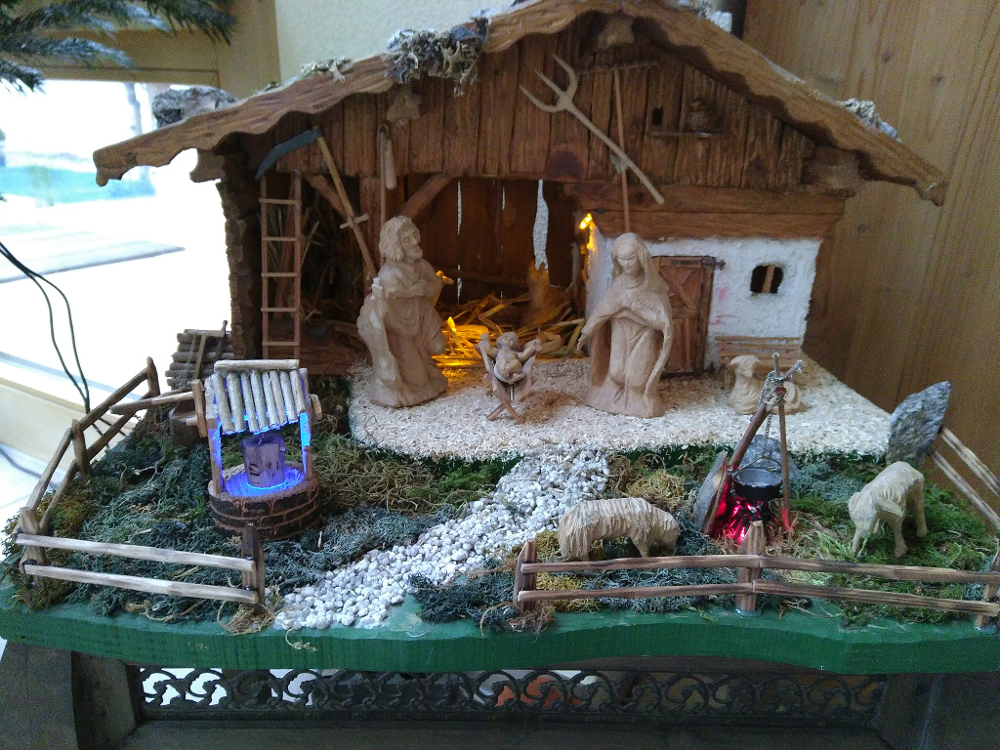

# Christmas Crib LEDs
this little project was a gift for my parents for christmas 2017. 
It's just a tiny pcb with an atmel avr attiny2313 microcontroller on it and
a transistor array to drive the leds. 

The Crib has some elements which are lighten by different LEDs.  
The *fountain* has a *blue led* which is slowly fading to simulate water waving.  
The *cabin* has two *orange leds*, one on the front of the building, the other one in the building itself. Both leds are just on or off.  
The *fireplace* has a *red led* which is flickering randomly pretty fast. This generates the effect that there is a real burning fire.  

# Required Parts 
These are the most important parts, all other things are normally lying around at home :)  

- ISP-Programmer (e.g. AVR-Dragon)
- ATTINY 2313 (Microcontroller)
- ULN2803 (Transistor-Array)
- Some LEDs, Resistors, Capacitors...

# Schematic 
The schematic is located under `files/schematic_christmas_crib.pdf`  
For the *fireplace* is a RGB-LED shown, but actually is just a single *red led* used. The effect of a buring fire was way better than first
expected, so I decided to only use the red one. 

# Picture 

